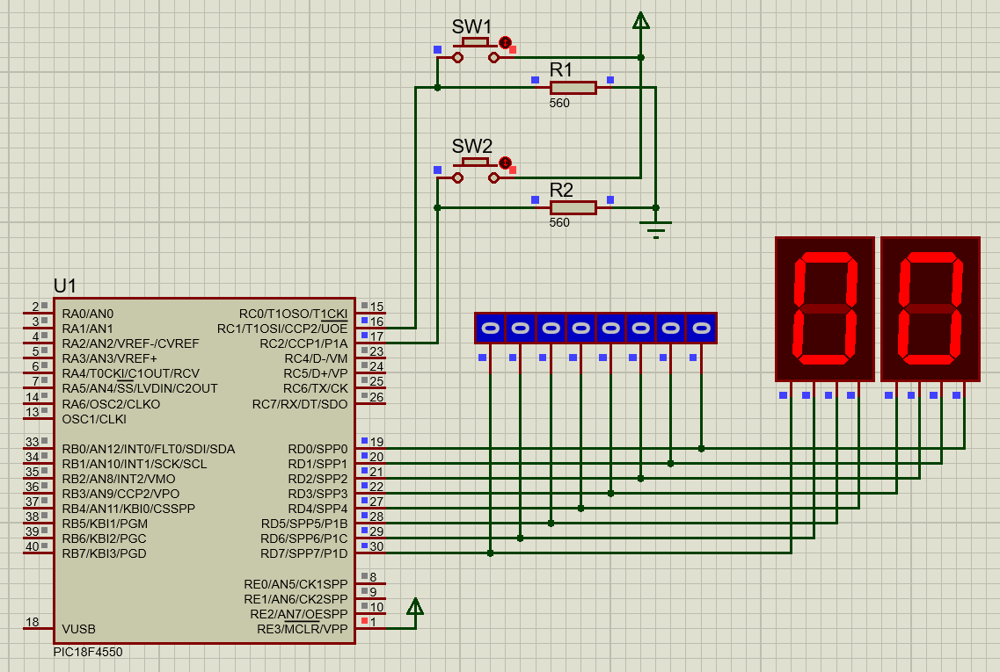
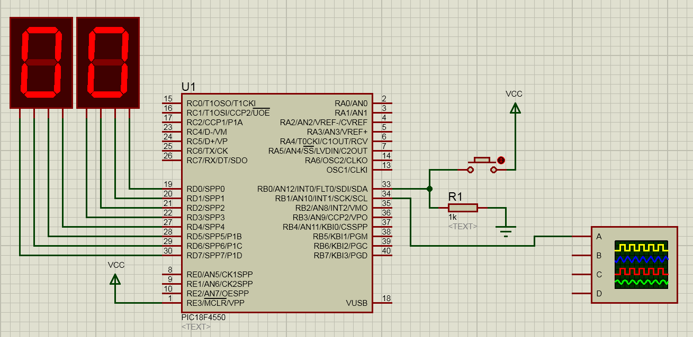

# Trabalho01 - Polling Button

[Microchip PIC18F Instruction Set](http://technology.niagarac.on.ca/staff/mboldin/18F_Instruction_Set/)

TRISX -> Direção das portas, onde X é a porta (1 in, 0 out)

PORTAS B - ENTRADAS
MOVLW 0XFF
MOVWF TRISB

PORTAS D - SAIDAS
MOVLW 0
MOVWF TRISD
OU
CLRF TRISD

# Interrupções

## Interrupções externas

### Prioridades
0X0008 - Alta
0X0018 - Baixa

Pinos de interrupção externa (Sensíveis à borda ~ subida ou descida)
- INT0 (RB0)
- INT1 (RB1)
- INT2 (RB2)

Registros de configuração
- INTCON
- INTCON1
- INTCON2

Bits de configuração

- INTXIE - Habilita INTX (Interruption enable)
- INTXIF - Sinaliza evento INTX (Interruption flag)
- IEDGX - Configura borda INTX

# Timer

- OSC - frequência inicial
- FOSC - divisor para frequência do núcleo da CPU gerando FCPU
- FCPU - fator de divisão para pre scaler
- PRE SCALER - gerador de frequência de acordo com um fator de divisão (fcpu)
- PC4R2
- TMR2ON - inicializa o timer

### Bits fator de divisão
b5 - T2CKPS0
b6 - T2CKPS1

T2CKPS1  |  T2CKPS0  |  FTMR2 
   0     |     0     |  Fcpu 
   0     |     1     |  Fcpu/4 
   1     |     X     |  Fcpu/16

- POST SCALER - configura quantos estouros são necessários para acionar TMR2IF
  b3:0 controlam o POST SCALER

PR2 = [0, 255]

## Exemplo

Fosc = 4 * 10 ^6 
POS = 0001 => 2 estouros

T estouro = (4 * PS * PR2 * POS) / Fosc
2 * 10^-3 = (PS * PR2 * 2) / 10 ^ 6

PS1 = 1 => PR2 = 1000  X
PS1 = 4 => PR2 = 250   V
PS1 = 16 => PR2 = 62,5   V

-----
